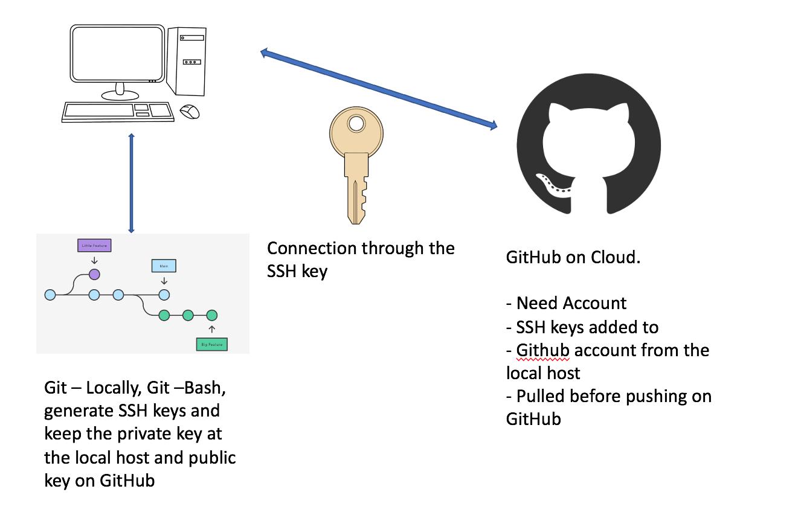

<h1>Git, GitHub and SSH keys</h1>

SSH keys are a standard protocol used to establish a secure shell session between remote computers over insecure networks, through cryptography. 

There are 5 main steps that are involved in the diagram above. 
1.	Creating an SSH key (Local)
2.	Registering a padlock (GitHub)
3.	Add private key to SSH register (Local)
4.	Create a test repo (GitHub)
5.	Use SSH to push changes (Local) r

<h3>Generating SSH keys?</h3>

1.	Download Git

•	Homebrew – Install git if you’re on mac to get the latest version

2.	Generating an SSH key
•	Open the terminal and creat a new folder within your documents where you keep all your README.md files .ssh. Use mkdir (Make Directory)

•	You may use this command: ssh-keygen -t rsa -b 4096 -C your_email@example.com

•	More information can be provided on the different types of keys here https://docs.github.com/en/authentication/connecting-to-github-with-ssh/generating-a-new-ssh-key-and-adding-it-to-the-ssh-agent#generating-a-new-ssh-key

•	Default settings can be used by pressing enter by following the on screen instructions

•	Enter your file name to which you would like your key to be called e.g., name-GitHub-Key

•	Rm = remove(key) if you would like to remove and add a new key

•	Find the .pub key and use the cat command to display the key on screen

•	Navigate to your GitHub account and enter the public key under “SSH and GPQ keys” under settings

•	If it’s the first time to add the key to the file: use eval ‘ssh-agent-s’ then ssh- add “your_key” then ssh -T -git@github.com

•	Make a new folder within your main branch same as the repo in GitHub

•	Using the touch README.md = creates a new file inside the folder created then use cat README.md

•	Using nano. README.md opens up a word document file within the terminal to add your information 

<h3>How to do the repository setup</h3>

	git init 
-initialises new repo on localhost
	
	git status 
-to check what was added to be sent to GitHub

	git add 
-adds all files/folders from the current location

	git commit -m "first commit" 
-m is to put any logical message

	git branch -M main 
-To change branch from master to main

	git remote add origin git@github.com:[user]/[repo].git 
-connects localhost to GitHub repo

	git push -u origin main 
-pushes the code upstream from localhost to GitHub

